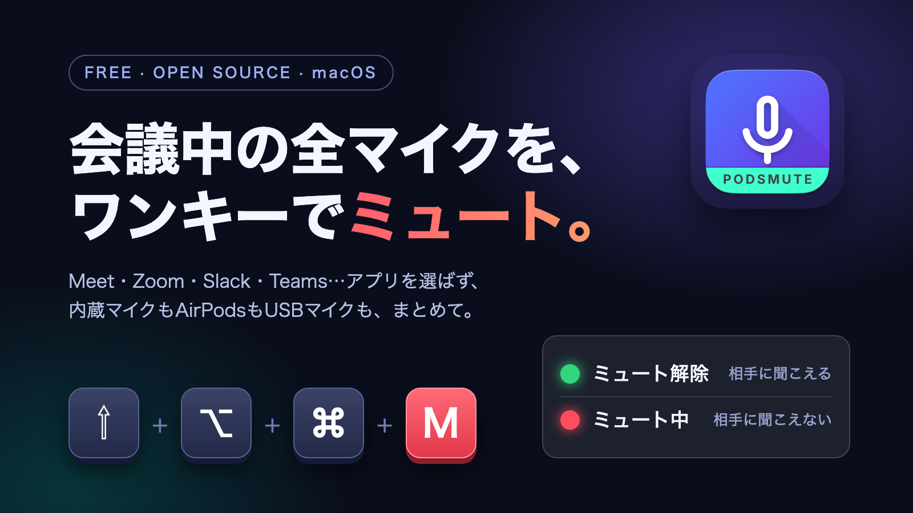

<p align="center">
  
</p>

# PodsMute

**会議中の全マイクを、ワンキーで確実にミュート。** macOS のメニューバーに常駐する、無料のオープンソースアプリです。

<p>
  <a href="https://github.com/Sakasuke/podsmute/releases/latest"><b>⬇︎ 最新版をダウンロード (DMG)</b></a>
  &nbsp;·&nbsp; macOS 13 以降 &nbsp;·&nbsp; Universal (Apple Silicon / Intel) &nbsp;·&nbsp; MIT License
</p>

> **English:** PodsMute is a tiny menu-bar app that mutes **every** microphone on your Mac with one global hotkey (**⇧⌥⌘M**) — in Google Meet, Zoom, Slack huddles, Teams, or anything else. Free, MIT-licensed, no network code. Jump to [Install](#使い方3ステップ) · [Build from source](#ソースからビルド) · [Troubleshooting](#troubleshooting).

---

## こんな経験、ありませんか？

- 話し始めてから「ミュートのままだった」と気づく。逆に「解除したつもりが…聞こえていた」
- Meet・Zoom・Slack…アプリごとにミュートボタンの場所も操作も違う
- AirPods を使っているつもりが、会議アプリは**別のマイク**を掴んでいて、ミュートしても声が漏れる
- 画面共有中に、ミュートのためだけにウィンドウを切り替えたくない

## PodsMute でできること

| | |
| --- | --- |
| ⌨️ **どのアプリが前面でも一発** | **`⇧⌥⌘M`**(Shift + Option + Command + M)でミュート / 解除。会議中はこれだけ覚えれば OK |
| 🎙 **全マイクをまとめてミュート** | 内蔵マイク・AirPods・USB マイクなど、実在する入力デバイスを**全部同時に**ミュート。会議アプリがどのデバイスを使っていても声が届きません(Teams などの仮想デバイスは除外)。デバイスの増減・切り替えがあっても、その時点のミュート状態を再適用します |
| 🚦 **状態が一目で分かる** | メニューバーのアイコンのバッジが、🟢 緑 = 話せる / 🔴 赤 = ミュート中 |
| 🖱 **クリックでも切り替え** | アイコンを**左クリック**でワンタップ切り替え。**右クリック**(または Control + クリック)でメニュー |
| 🪶 **軽い** | Dock に出ないメニューバー常駐アプリ。起動直後の実測は CPU ほぼ 0%、実質メモリ約 14 MB |
| 🔒 **権限は最小限** | ホットキーは Carbon の `RegisterEventHotKey` を使うので、**アクセシビリティ / 入力監視の許可は不要**。ネットワーク通信のコードは含まれていません(ソースで確認できます) |
| 🆓 **無料・オープンソース** | MIT License。改造も再配布も自由です |

## 使い方(3ステップ)

1. **[最新の DMG をダウンロード](https://github.com/Sakasuke/podsmute/releases/latest)** → 開いて、`PodsMute` を `Applications` フォルダにドラッグ
2. **初回だけ**: Applications の `PodsMute` を **右クリック →「開く」**
   - Apple の公証(notarization)を受けていない、手元で署名(ad-hoc)したアプリのため、初回は「開発元を確認できません」と表示されます。右クリックから開くか、**システム設定 → プライバシーとセキュリティ → 「このまま開く」** で一度許可すれば以後は普通に起動します
   - Bluetooth のアクセス許可を聞かれることがあります(メニューの「AirPods 接続状態」表示に使います)
3. メニューバーにアイコンが出たら準備完了。**`⇧⌥⌘M`** で全マイクがミュート、もう一度押すと解除

ログイン時に自動で起動したい場合は、**システム設定 → 一般 → ログイン項目 →「ログイン時に開く」** に PodsMute を追加してください。

### 状態の見方

| バッジ | 意味 |
| --- | --- |
| 🟢 緑のマイク | ミュート解除(相手に聞こえる) |
| 🔴 赤のマイク(斜線) | ミュート中(相手に聞こえない) |

> ### ⚠️ これは「OS レベル」のミュートです
> Meet / Zoom / Slack の**画面上のミュートボタンとは連動しません**。アプリ側が「ミュート解除」と表示していても、PodsMute のバッジが 🔴 なら相手には聞こえていません。**メニューバーのバッジが正解の状態です。**

<details>
<summary><b>AirPods のステム操作でもミュートしたい(実験的)</b></summary>

元の podsmute の機能で、AirPods の「ミュート / ミュート解除」ジェスチャを捕まえてミュートします。ただし、macOS(Sonoma〜Tahoe)では Meet / Zoom / Slack が OS に「通話(電話 / FaceTime)」として認識されず、AirPods が常にメディア再生モードのままになるため、**このジェスチャ自体が発動しない**ことを確認しています(`audioaccessoryd` のログにミュートイベントが出ません)。そのため、このフォークでは確実に効くグローバルショートカットを主操作にしています。ジェスチャが使える環境では次のとおりです。

1. AirPods Pro のファームウェアを最新に(mute / unmute は **6A300 以降**が必要)
2. **システム設定 →(サイドバーの)お使いの AirPods** →「通話コントロール」で、ステムの 1 回押しまたは 2 回押しに **「ミュート / ミュート解除」** を割り当てる
3. 通話中(マイクが使われている状態)にステムを押す

</details>

## 動作環境

- **macOS 13 以降**
- **Universal バイナリ**(Apple Silicon + Intel)。**Apple Silicon で動作確認済み。Intel 向けもビルドに含めていますが、実機では未検証**です。動かない場合は [Issue](https://github.com/Sakasuke/podsmute/issues) で教えてください
- AirPods は不要です(ホットキーだけで使えます)

## 既知の事項

- Apple の公証を受けていないため、初回起動に「右クリック →『開く』」が必要です。
- **v1.0.0 をお使いの方は v1.0.1 に更新してください。** v1.0.0 には、条件によってマイクのミュート設定を毎秒数回書き込み続けてしまう不具合がありました。Mac がスリープしなくなり、発熱や電池の消耗につながります。v1.0.1 では、状態が変わっていないデバイスには書き込まず、通知が続いても書き込みが連鎖しないように修正しました。
- v1.0.0 で、数日間の連続稼働で実質メモリ(圧縮分を含む)が数百 MB まで増えた事例を 1 件観測しています。上の不具合が原因だった可能性が高いと見ていますが、v1.0.1 での長期稼働はまだ確認中です。

---

## ソースからビルド

**Command Line Tools だけ**でビルドできます(フル Xcode は不要)。

```bash
git clone https://github.com/Sakasuke/podsmute.git
cd podsmute
./build.sh        # dist/PodsMute.app を生成(Universal。未対応の環境では実行中の CPU のみ)
./make-dmg.sh     # dist/PodsMute.dmg も作る
```

Xcode で開く場合(元のフロー): `brew install xcodegen && xcodegen generate && open PodsMute.xcodeproj`

## なぜ効くのか / How it works

普通の会議アプリは AirPods の「ミュート」ジェスチャに対応していません。PodsMute は **Core Audio で入力デバイスそのものをミュート**します。デバイスがミュートされれば、どのアプリを使っていても相手には声が届きません。

```
⇧⌥⌘M (global hotkey)        ─┐
menu-bar icon click          ─┼──▶  PodsMute
AirPods stem press (optional)─┘         │
   (audioaccessoryd notification)       ▼
                       Core Audio: mute ALL real input devices  ← works in ALL apps
```

> **全入力デバイスをまとめてミュートします。** 既定の 1 台だけをミュートすると、会議アプリが別のデバイス(例: 既定は内蔵マイクなのに会議は AirPods を使用)を掴んでいたときに無音になりません。そこで実在する入力デバイスを**全部同時に**ミュート / 解除します(Teams 等の仮想デバイスは除外)。

## What this fork adds

This is a fork of [cyanicr/podsmute](https://github.com/cyanicr/podsmute).

| Area | Upstream | This fork |
| --- | --- | --- |
| Trigger | AirPods mute gesture | Adds a **global hotkey (⇧⌥⌘M)**; left-clicking the menu-bar icon is a one-tap toggle |
| Mute scope | Default input device | **All real input devices** (virtual / loopback devices skipped) |
| Build | Requires full **Xcode** + `xcodegen` | Also builds with **Command Line Tools only** via `Package.swift` + `build.sh` (`swift build`, Universal) |
| Distribution | Build it yourself | Prebuilt **DMG** on the [Releases](https://github.com/Sakasuke/podsmute/releases) page |
| Entry point | SwiftUI `@main` (`App/PodsMuteApp.swift`) | Adds AppKit `App/main.swift` for the SPM build (SwiftUI file kept for the Xcode build) |
| Mute detection | Registers several speculative notifications + distributed-center listeners **always on** | Listens to `com.apple.audioaccessoryd.MuteState` by default; **debounces duplicates** and **suppresses the echo** from our own mute change so one press = one toggle; extra names gated behind `PODSMUTE_DEBUG` |
| Diagnostics | `print` to stdout (invisible when launched as a bundle) | `os.Logger` (subsystem `com.podsmute.app`) visible in **Console.app**, plus a `PODSMUTE_DEBUG=1` mode |

Both build paths share the same services (`AudioMuteController`, `AudioAccessoryMonitor`, `BluetoothManager`, `StatusBarController`).

## Verifying it works (without a live call)

You can simulate an AirPods press by posting the same Darwin notification, then check that the badge flips:

```bash
open dist/PodsMute.app
# in another shell:
notifyutil -p com.apple.audioaccessoryd.MuteState   # = one "press"
```

Watch the menu-bar badge toggle red / green.

## Troubleshooting

**Nothing happens when I press ⇧⌥⌘M.**
Another app may already own that shortcut. Check that the PodsMute icon is in the menu bar, and try left-clicking the icon: if the badge flips, the mute itself works and only the shortcut is taken.

**The badge toggles but I'm still heard (or still muted).**
Your input device must support the Core Audio mute property. Check System Settings → Sound → Input. The built-in mic and AirPods both support mute on recent macOS.

**The app's own mute button (Zoom / Meet) disagrees with the badge.**
Expected — this app mutes at the OS level, independent of the app's button. Trust the menu-bar badge.

**AirPods stem press does nothing during a call.**
See the *AirPods* section above — on modern macOS, Meet / Zoom / Slack don't put AirPods into call mode, so the gesture never fires. Use the hotkey. To see what your macOS emits, run in diagnostic mode and watch the log:

```bash
# Launch with the debug switch (logs every notification, watches extra names):
open -n --env PODSMUTE_DEBUG=1 dist/PodsMute.app
# Then stream the log (or filter subsystem com.podsmute.app in Console.app):
log stream --level debug --predicate 'subsystem == "com.podsmute.app"'
```

> Launch the app with Finder or `open`. Running the binary directly from a terminal can be aborted by macOS privacy protection (TCC) when the terminal app has no Bluetooth usage description.

## Credits

- Upstream: [cyanicr/podsmute](https://github.com/cyanicr/podsmute) — the original idea and implementation
- Protocol research: [librepods](https://github.com/kavishdevar/librepods)

## License

[MIT](LICENSE). Upstream ([cyanicr/podsmute](https://github.com/cyanicr/podsmute)) is MIT-licensed as stated in its README; this fork's changes are released under the same license.
